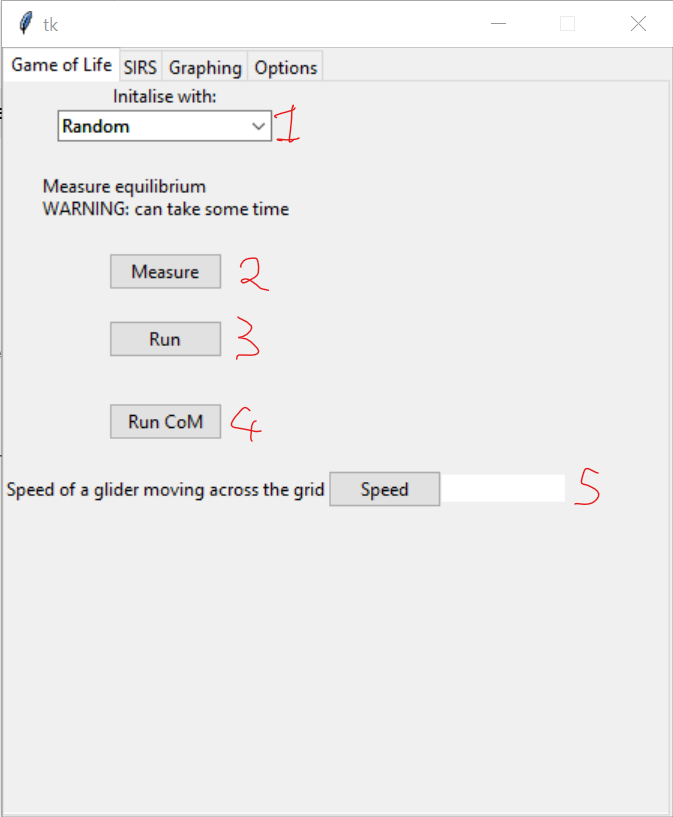
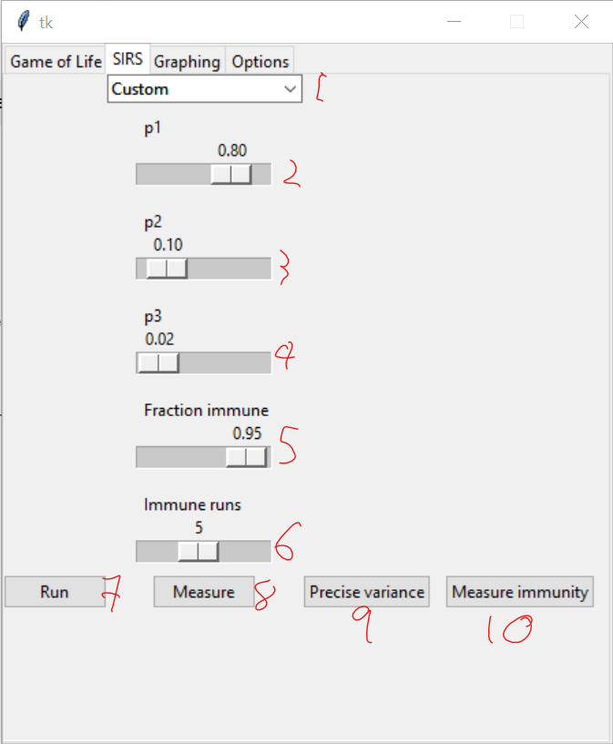
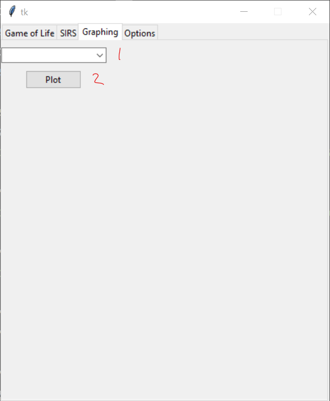
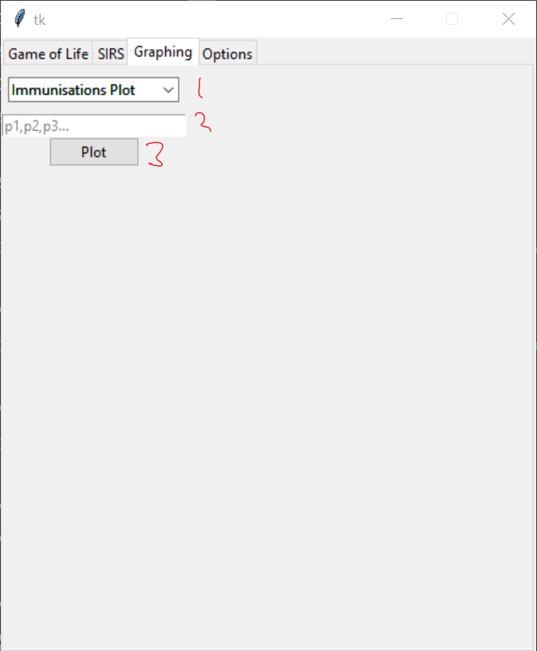

Cellular Automata
=================
A solution to checkpoint 2 for the Modelling and Visualisation in Physics course
studying cellular automata with 2 use cases: Conway's Game of Life and the SIRS
model of epidemic spreading.

Contents
--------
1. Prerequisites
2. Using the UI
3. Game of Life
4. SIRS
5. Graphing
6. Options

Prerequisites
-------------
See requirements.txt

Using the UI
------------
To open the UI, run the file display.py

Game of Life
------------

1. The method by which the grid will be initalised
2. The measure button. Pressing will start measuring how long the system
takes to reach equilibrium, and will produce a datafile for a histogram of the
results
3. The run button. This button will animate the system using the initial conditions
from 1.
4. The run COM button. This will animate the centre of mass of the system using the 
initial conditions
5. The speed button. This will measure the speed of a glider moving through the system
and display it in the text box.

SIRS
----

1. Choose predefined values for the system to show either dynamic equilibrium,
cyclic waves, or an absorbing state. Choose custom to set your own values
2. p1. Probability of a susceptible agent becoming infected
3. p2. Probability of an infected agent recovering
4. p3. Probability of a recovered agent becoming susceptible
5. Fraction immune. Fraction of the agents which start immune to the infection
6. Immune runs. Used for determining how many runs to perform the immunity measurements
7. Run. Animates the system for the given values
8. Measure. Will measure the infected population and its variance with changing p1 and p3.
Produces a data file for the phase diagram and contour plot.
9. Precise variance. Measures the variance of the infected population with p1 between 0.2 and
0.5. Produces a data file for the line plot.
10. Measure immunity. Measures how the infected population changes over an increase in the immune
population. Uses the chosen values for p1, p2, and p3.

Graphing
--------

1. choose which plot to display
2. Plot button. Displays the plot and saves the image

3. For deciding which immunity graph to plot. Enter the probabilities chosing as p1,p2,p3
e.g. 0.5,0.5,0.5

Options
------

1. Grid size
2. Colour of an active cell for Game of Life or susceptible cell for SIRS
3. Colour of an infected cell in SIRS
4. Colour of a dead cell in Game of Life or recovered cell in SIRS
5. Colour of an immune cell in SIRS
6. Display steps. The number of steps for which to animate the systems
7. Measurement Sweeps. The number of sweeps to perform after reaching equilibrium
8. Precision. The interval to increase the variables by in the SIRS model.
9. Apply Button. Applies these settings. This must be pressed for the changes to take effect.
